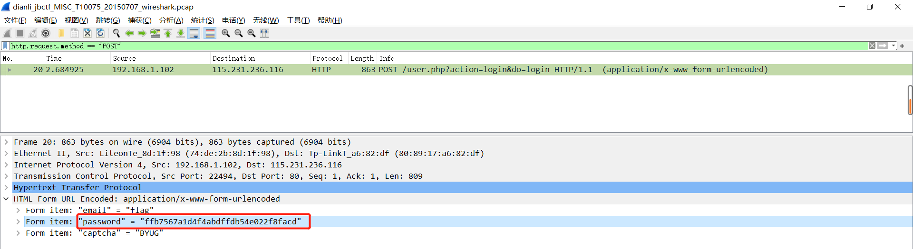

# [wireshark](https://buuoj.cn/challenges#wireshark)

## 解题步骤

1. 首先下载下来的是`zip`包，解压得到一个`pcap`包，题目中有提示：`管理员的密码即是答案`
2. 用户名、密码的登录认证，一般是通过`post`请求进行登录。所以使用`wireshark`对`post`请求进行过滤：`http.request.method == "POST"`
3. 过滤完之后只有一个`post`请求，`flag`位于密码字段   

   

## 参考资料

- [Wireshark的常用过滤规则](https://www.jianshu.com/p/63f6f7d5deed)