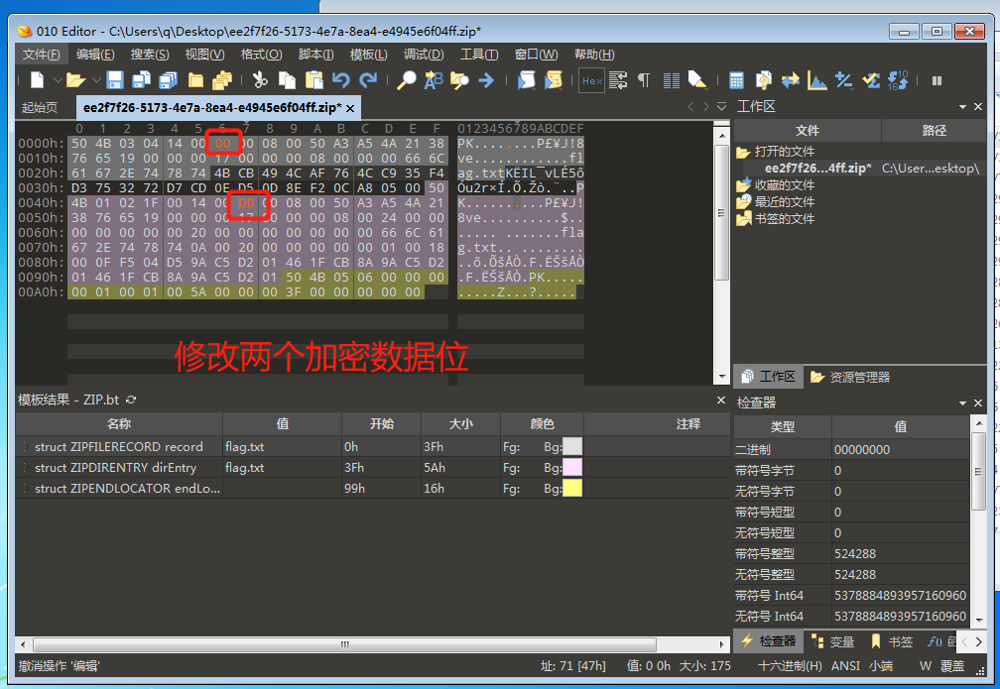
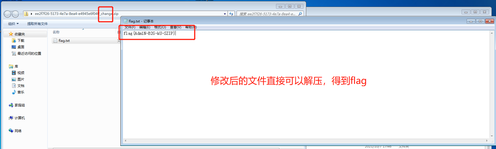

# [[buuctf]zip伪加密](https://buuoj.cn/challenges#zip%E4%BC%AA%E5%8A%A0%E5%AF%86)

## 解题步骤

1. 下载下来的`zip`包打开提示需要解压密码。但是题目提示的是`伪加密`，所以应该不是使用暴力破解的方法
2. 使用[010Editor](https://github.com/linzqin/CTFWriteUp/blob/master/%E5%B7%A5%E5%85%B7%E4%BD%BF%E7%94%A8/010Editor.md)打开文件
3. 对两个加密点的数据都尝试修改一下，改为偶数后将文件保存   

> `zip`相关文件格式，[详见](https://github.com/linzqin/CTFWriteUp/blob/master/%E9%9B%B6%E7%A2%8E%E7%9A%84%E7%9F%A5%E8%AF%86%E7%82%B9/zip%E6%96%87%E4%BB%B6.md)    

         

4. 修改后的压缩包可以直接解压，打开后即可得到`flag`   

    
