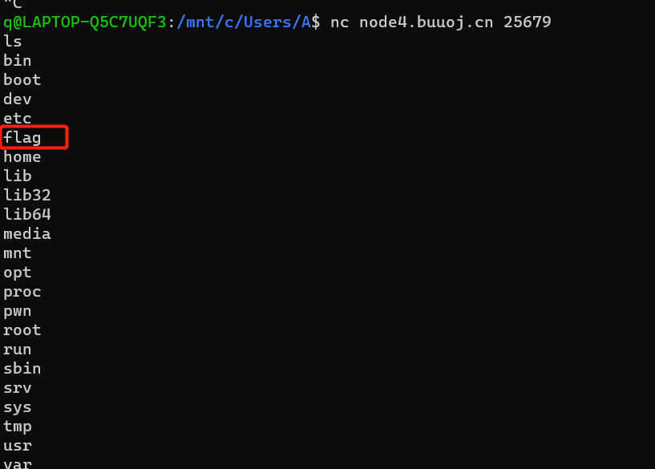
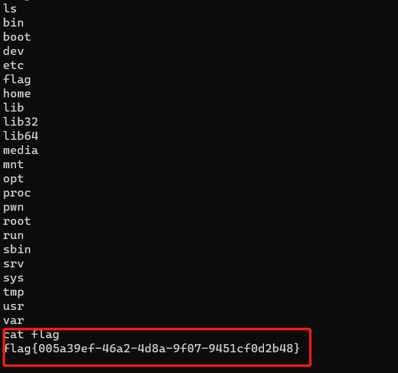

# [[Buuctf]test_your_nc](https://buuoj.cn/challenges#test_your_nc)

## 知识点

- `nc`的使用

## 解题步骤


1. 使用`nc`进行端口扫描
```bash
# nc hostname port
nc node4.buuoj.cn 25679
# 扫描文件
ls    
```     

          

2. 发现目录下有一个`flag`文件，参看文件内容就能得到`flag`     

     


## 参考资料

- [Linux nc 命令详解](https://blog.csdn.net/zhangxiao93/article/details/52705642)
- [网络安全入门之 BUUCTF Pwn - test your nc](https://zhuanlan.zhihu.com/p/153556977)