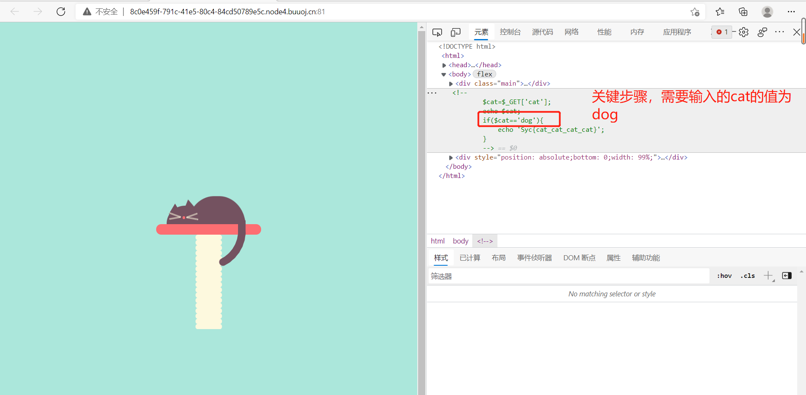
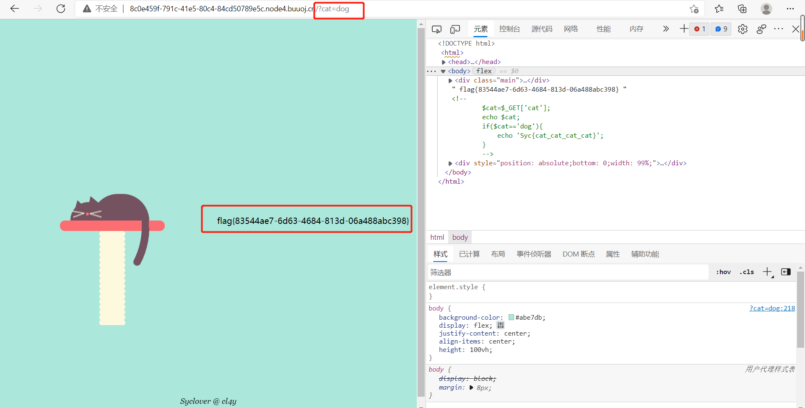

# [[极客大挑战 2019]Havefun](https://buuoj.cn/challenges#[%E6%9E%81%E5%AE%A2%E5%A4%A7%E6%8C%91%E6%88%98%202019]Havefun)

## 解题步骤

1. 直接查看`开发者工具`，发现了一段含有`判断语句`的代码    

    

2. 在网页后面加上`?cat=dog`，就可以得到`flag`    

    

