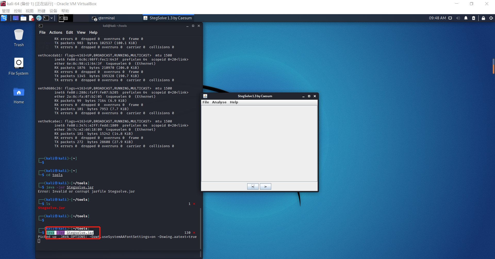

# StegSolve

## 安装

###  java环境安装

1. 下载[java](https://www.oracle.com/java/technologies/downloads/)并进行解压
```bash
# 下载java17
wget https://download.oracle.com/java/17/latest/jdk-17_linux-x64_bin.tar.gz

# 移动压缩包至opt目录
mv jdk-17_linux-x64_bin.tar.gz /etc/opt
 
#切换至opt目录进行解压
cd /etc/opt
 
#解压
tar -zxvf jdk-17_linux-x64_bin.tar.gz
 
#拷贝解压后Java文件夹至/usr/bin
cp -r jdk-17/ /usr/bin
 
#安装并注册
update-alternatives --install /usr/bin/java java /etc/opt/jdk-17/bin/java 1
update-alternatives --install /usr/bin/javac javac /etc/opt/jdk-17/bin/javac 1
update-alternatives --set java /etc/opt/jdk-17/bin/java
update-alternatives --set javac /etc/opt/jdk-17/bin/javac
 
#检查是否成功配置Java环境
java -version

# java version "17" 2021-09-14 LTS
# Java(TM) SE Runtime Environment (build 17+35-LTS-2724)
# Java HotSpot(TM) 64-Bit Server VM (build 17+35-LTS-2724, mixed mode, sharing)

```

### StegSolve安装

1. 安装和使用`StegSolve`
```bash
wget http://www.caseum.com/handbook/Stegsolve.jar
java -jar Stegsolve.jar
```   

   

## 使用

### Analyse

- `File Format`:文件格式，这个主要是查看图片的具体信息   

   

- `Data Extract`:数据抽取，图片中隐藏数据的抽取
    - `Alpha`就是透明度 该通道用`256`级灰度来记录图像中的透明度信息，定义透明、不透明和半透明区域。`alpha`的值为0就是全透明，`alpha`的值为`255`则表示不透明
- `Frame Browser`:帧浏览器，主要是对`GIF`之类的动图进行分解，动图变成一张张图片，便于查看

- `Image Combiner`:拼图，图片拼接

## 参考资料

- [在Kali Linux中下载工具Stegsolve](https://www.bbsmax.com/A/rV57X4QWdP/)
- [Kali中安装Java环境（保你一次性安装成功）](https://blog.csdn.net/userpass_word/article/details/103838606)
- [stegsolve使用方法](https://www.cnblogs.com/cat47/p/11483478.html)