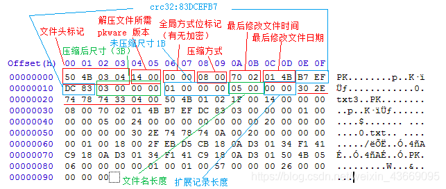
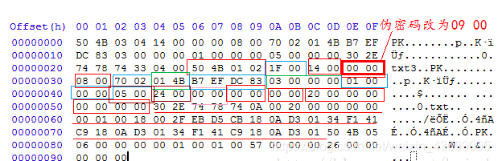

# zip文件

## zip文件格式

- [文件头+文件数据+数据描述符]{此处可重复n次}+核心目录+目录结束标识
    - 当压缩包中有多个文件时，就会有多个[文件头+文件数据+数据描述符]

- 压缩源文件数据区(文件头+文件数据+数据描述符)   

    

- 压缩源文件目录区(核心目录)    

    

## 参考资料

- [ZIP文件格式分析](https://blog.csdn.net/a200710716/article/details/51644421)
- [BUUCTF ZIP伪加密](https://blog.csdn.net/MikeCoke/article/details/105877451)
- [两个加密标识位修改造成不同的效果](https://blog.csdn.net/afanzcf/article/details/119794319)